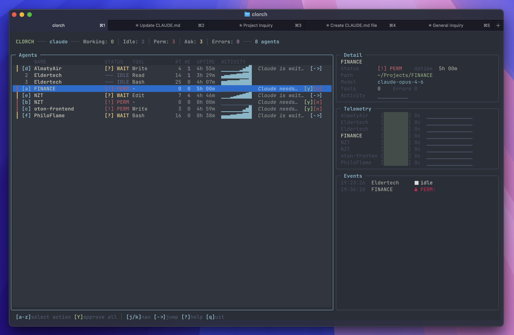

# Clorch

Mission control for [Claude Code](https://docs.anthropic.com/en/docs/claude-code) sessions.



You run 10–20 Claude Code sessions at once. One needs a file change approved, another is waiting for a skill, a third just finished its plan — and you're alt-tabbing through a wall of terminal tabs trying to keep up.

**Clorch** is mission control. One dashboard shows every active session: what it's doing, what it needs. Approve a permission right here, or jump to the right tab in one keystroke.

## Features

- **Real-time tracking** — hooks push events, no terminal scraping or polling
- **Approve / deny** permissions without leaving the dashboard (`y` / `n` / `Y` for all)
- **YOLO mode** — auto-approve all tool requests with one key (`!`), deny rules still force manual review
- **Rules engine** — configurable per-tool auto-approve/deny via `~/.config/clorch/rules.yaml`
- **Jump** to any Claude Code's session in one keystroke
- **Action queue** — pending permissions are listed with hotkeys, newest first
- **Git context** — branch name and dirty file count per agent
- **Staleness detection** — yellow/red timer on agents idle >30s/120s
- **Sound alerts** — distinct macOS system sounds for permission, answer, and error states
- **tmux status-bar widget** — agent counts at a glance

## Quick Start

```bash
# Prerequisites (macOS)
brew install jq tmux

# Prerequisites (Linux)
# apt install jq tmux

# Install Clorch
pip install git+https://github.com/androsovm/clorch.git

# Install hooks into Claude Code settings
clorch init

# Launch the dashboard
clorch
```

`clorch init` adds hooks to `~/.claude/settings.json` (backup is created automatically). From this point, every Claude Code session reports its state to Clorch.

## CLI

```
clorch              Launch TUI dashboard (default)
clorch init         Install hooks into ~/.claude/settings.json
clorch init --dry-run   Preview changes without writing
clorch uninstall    Remove hooks from settings
clorch status       One-line summary for scripts
clorch list         Table view in terminal
clorch tmux-widget  Output for tmux status-right
clorch --version    Print version
```

## TUI Keybindings

| Key | Action |
|-----|--------|
| `j` / `k` | Move selection up / down |
| `→` | Jump to selected agent's session |
| `a`–`z` | Focus an action item |
| `y` / `n` | Approve / deny focused permission |
| `Y` | Approve **all** pending permissions |
| `!` | Toggle YOLO mode (auto-approve) |
| `s` | Toggle sound notifications |
| `d` | Toggle agent detail panel |
| `?` | Help overlay |

## How It Works

```
Claude Code hooks
  → event_handler.sh / notify_handler.sh
    → /tmp/clorch/state/<session_id>.json
      → Dashboard reads state every 500 ms
      → macOS notification + bell on attention events
```

Clorch hooks into [Claude Code's hook system](https://docs.anthropic.com/en/docs/claude-code/hooks). Each Claude Code session triggers shell scripts that write a JSON state file. The TUI reads those files on a timer. No terminal scraping, no ptrace, no API — just files on disk.

## Safety

Clorch does not read, modify, or access your project files. Here's what it touches:

- **`~/.claude/settings.json`** — `clorch init` adds hook entries (a timestamped backup is created before any changes)
- **`/tmp/clorch/state/`** — per-session JSON files with agent status, updated by hook scripts
- **No network** — all communication is local, through files on disk
- **`clorch uninstall`** — cleanly removes all hooks from settings

## Requirements

- Python 3.10+
- `jq` — used by hook scripts to parse JSON
- `tmux` — agent sessions run in tmux windows

## Platform Support

| Feature | macOS + iTerm2 | macOS + Ghostty | macOS + Terminal | Linux |
|---------|:-:|:-:|:-:|:-:|
| Dashboard & approve/deny | yes | yes | yes | yes |
| Jump to agent (tmux) | yes | yes | yes | yes |
| Jump to agent (native tab) | yes | — | — | — |
| Open tmux window as tab | yes | yes* | — | — |
| Native notifications | yes | yes | yes | — |
| Terminal bell | yes | yes | yes | yes |
| tmux status-bar widget | yes | yes | yes | yes |

\* Ghostty tab creation requires Accessibility permission for `osascript`. Without it, a new Ghostty window is opened instead.

## Configuration

| Variable | Default | Description |
|----------|---------|-------------|
| `CLORCH_STATE_DIR` | `/tmp/clorch/state` | Directory for agent state files |
| `CLORCH_SESSION` | `claude` | tmux session name |
| `CLORCH_TERMINAL` | auto-detect | Force terminal backend: `iterm`, `ghostty`, `apple_terminal` |

### Auto-approve rules

Create `~/.config/clorch/rules.yaml` to configure YOLO mode and per-tool rules:

```yaml
yolo: false          # start with YOLO off (toggle with [!] in TUI)

rules:
  - tools: [Bash]
    pattern: "rm -rf"
    action: deny       # always require manual review

  - tools: [Read, Glob, Grep]
    action: approve    # safe read-only tools
```

- **First matching rule wins**, unmatched tools follow YOLO state (approve if on, ask if off)
- **Deny rules force manual review** even when YOLO is active
- YOLO auto-approve only works for agents running in tmux sessions

## Development

```bash
python -m venv .venv
source .venv/bin/activate
pip install -e '.[rich]'
pytest
```

## Contributing

Issues and PRs are welcome. Keep changes small, add tests for new logic, and keep the CLI output stable.

## License

[MIT](LICENSE)
