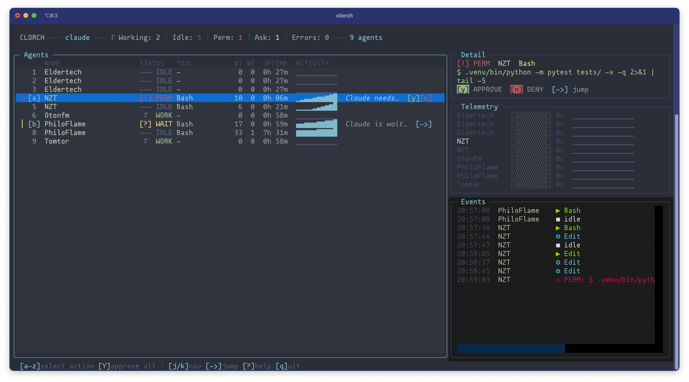

# Clorch

Mission control for [Claude Code](https://docs.anthropic.com/en/docs/claude-code) sessions.



You run 10 agents across iTerm tabs. One asks for permission, two are idle, and you can't remember which tab has the one that's stuck. You Cmd-Tab through terminals, lose focus, and waste minutes just *finding* the right session.

Clorch fixes this. One dashboard shows every agent's status. Permission request pops up — press `y` without switching tabs. Need to jump to a session — press `Enter`. That's it.

## Features

- **Real-time tracking** — hooks push events, no terminal scraping or polling
- **Approve / deny** permissions without leaving the dashboard (`y` / `n` / `Y` for all)
- **Jump** to any agent's iTerm2 tab in one keystroke
- **Action queue** — pending permissions are listed with hotkeys, newest first
- **macOS notifications** and terminal bell when an agent needs attention
- **tmux support** — status-bar widget, window splits, and navigation

## Quick Start

```bash
# Install from source
pip install -e .

# Install hooks into Claude Code settings
clorch init

# Launch the dashboard
clorch
```

`clorch init` adds hooks to `~/.claude/settings.json` (backup is created automatically). From this point, every Claude Code session reports its state to Clorch.

## CLI

```
clorch              Launch TUI dashboard (default)
clorch init         Install hooks into ~/.claude/settings.json
clorch init --dry-run   Preview changes without writing
clorch uninstall    Remove hooks from settings
clorch status       One-line summary for scripts
clorch list         Table view in terminal
clorch tmux-widget  Output for tmux status-right
clorch --version    Print version
```

## TUI Keybindings

### Navigation

| Key | Action |
|-----|--------|
| `j` / `k` | Move selection up / down |
| `1`–`0` | Jump to agent by row number |
| `Enter` / `Right` | Jump to selected agent's session |
| `d` | Toggle detail panel |
| `r` | Refresh |
| `?` | Help overlay |
| `q` | Quit |

### Action Queue

| Key | Action |
|-----|--------|
| `a`–`z` | Focus an action item |
| `y` / `n` | Approve / deny focused permission |
| `Y` | Approve **all** pending permissions |
| `Esc` | Cancel selection |

### tmux (optional)

| Key | Action |
|-----|--------|
| `N` | Create a new tmux window (prompts for name) |
| `S` / `V` | Split selected agent's window (horizontal / vertical) |
| `X` | Kill selected agent's tmux window |

If you use tmux, add a status-bar widget to `~/.tmux.conf`:

```bash
set -g status-right '#(clorch tmux-widget)'
set -g status-interval 2

# Jump to the next agent needing attention
bind-key ! run-shell "python -m clorch.tmux.navigator"
```

## How It Works

```
Claude Code hooks
  → event_handler.sh / notify_handler.sh
    → /tmp/clorch/state/<session_id>.json
      → Dashboard reads state every 500 ms
      → macOS notification + bell on attention events
```

Clorch hooks into [Claude Code's hook system](https://docs.anthropic.com/en/docs/claude-code/hooks). Each Claude Code session triggers shell scripts that write a JSON state file. The TUI reads those files on a timer. No terminal scraping, no ptrace, no API — just files on disk.

## Requirements

- Python 3.10+
- `jq` — used by hook scripts to parse JSON
- `tmux` (optional) — enables splits, status-bar widget, and window management
- macOS (optional) — native notifications via `osascript`; everything else works on Linux

## Configuration

| Variable | Default | Description |
|----------|---------|-------------|
| `CLORCH_STATE_DIR` | `/tmp/clorch/state` | Directory for agent state files |
| `CLORCH_SESSION` | `claude` | tmux session name |

## Development

```bash
python -m venv .venv
source .venv/bin/activate
pip install -e '.[rich]'
pytest
```

## Contributing

Issues and PRs are welcome. Keep changes small, add tests for new logic, and keep the CLI output stable.

## License

[MIT](LICENSE)
